# Used Car Price Predictor

A machine-learning **Data App** that helps a used-car dealership price its stock. It learns
from 97,442 real UK used-car listings to (1) explain which attributes drive a car's price and
(2) predict the likely sale price of any car from its details.

**Live app:** https://used-car-price-predictor-cb-b0fa419f68f7.herokuapp.com/

**Repository:** https://github.com/Cbyrne290-HUB/used-car-price-predictor

**Author:** Callum Byrne

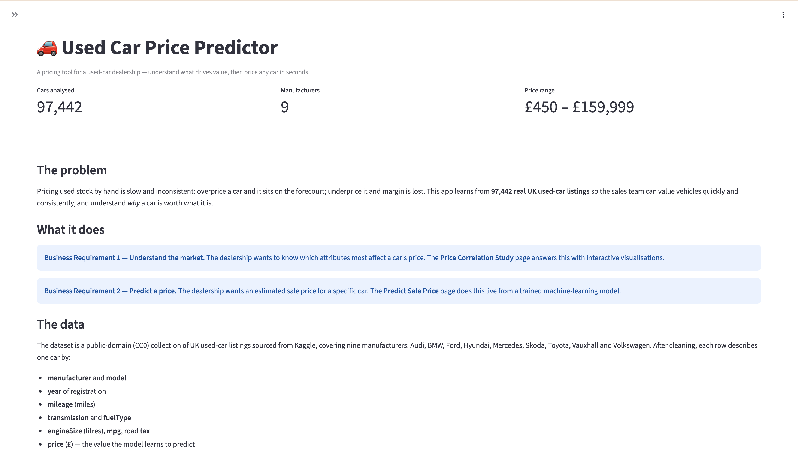

---

## Table of Contents
1. [Dataset Content](#dataset-content)
2. [Business Requirements](#business-requirements)
3. [Hypotheses and Validation](#hypotheses-and-validation)
4. [Mapping Business Requirements to Data Visualisations and ML Tasks](#mapping-business-requirements-to-data-visualisations-and-ml-tasks)
5. [ML Business Case](#ml-business-case)
6. [CRISP-DM Workflow](#crisp-dm-workflow)
7. [Dashboard Design](#dashboard-design)
8. [Unfixed Bugs](#unfixed-bugs)
9. [Deployment](#deployment)
10. [Main Data Analysis and ML Libraries](#main-data-analysis-and-ml-libraries)
11. [Credits](#credits)

---

## Dataset Content

The dataset is the **"100,000 UK Used Car Data set"** from Kaggle, released under a
**CC0: Public Domain** licence, which permits free use for this project. It contains scraped
listings of used cars from nine manufacturers: **Audi, BMW, Ford, Hyundai, Mercedes, Skoda,
Toyota, Vauxhall and Volkswagen**.

The raw data arrives as one CSV per manufacturer. Notebook 1 combines them into a single table
and adds a `manufacturer` column. After cleaning (Notebook 2), the dataset contains
**97,442 rows and 10 columns**:

| Variable | Meaning | Type |
|---|---|---|
| `manufacturer` | Car maker | Categorical |
| `model` | Model name | Categorical |
| `year` | Year of registration | Numeric |
| `price` | Sale price in £ (the prediction target) | Numeric |
| `transmission` | Manual / Automatic / Semi-Auto / Other | Categorical |
| `mileage` | Miles driven | Numeric |
| `fuelType` | Petrol / Diesel / Hybrid / Electric / Other | Categorical |
| `tax` | Annual road tax (£) | Numeric |
| `mpg` | Miles per gallon | Numeric |
| `engineSize` | Engine size in litres | Numeric |

---

## Business Requirements

A used-car dealership prices its stock by hand, which is slow and inconsistent: overpricing
leaves cars sitting on the forecourt, while underpricing loses margin. The dealership asked for
a tool, backed by historical sales data, to make pricing faster and more consistent.

- **Business Requirement 1 — Understand the market.** The dealership wants to understand which
  car attributes most strongly influence the sale price, so it can justify and explain its
  pricing. This is answered with a **data analysis and visualisation study**.
- **Business Requirement 2 — Predict a price.** The dealership wants to estimate the likely
  sale price of a specific car from its attributes. This is answered with a **machine-learning
  prediction model** exposed through the dashboard.

---

## Hypotheses and Validation

Three hypotheses were defined before modelling. Each was tested statistically on the cleaned
data in the Correlation Study notebook, and each is reproduced live on the dashboard's
**Project Hypotheses** page.

**Hypothesis 1 — Higher mileage means a lower price.**
*Validation:* Spearman rank correlation between `mileage` and `price`.
*Result:* correlation = **−0.51** (p < 0.001) — a clear negative relationship. **Supported.**

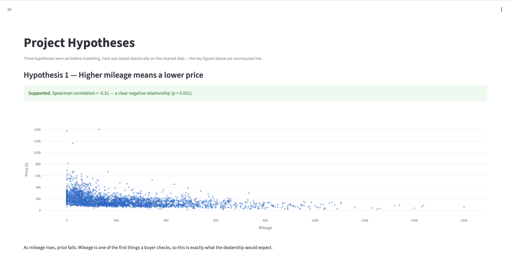

**Hypothesis 2 — Newer cars are worth more.**
*Validation:* Spearman rank correlation between `year` and `price`.
*Result:* correlation = **+0.60** (p < 0.001) — a strong positive relationship. **Supported.**

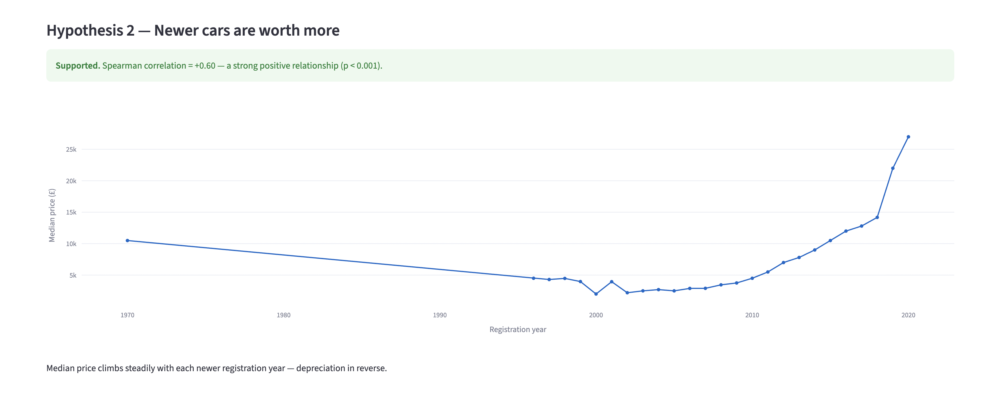

**Hypothesis 3 — Transmission type affects price.**
*Validation:* a Kruskal–Wallis H-test comparing price across transmission types (the groups are
non-normal, so a non-parametric test is appropriate).
*Result:* **H = 35,717 (p < 0.001)** — price differs significantly by transmission. Median price
rises Manual (£11,000) → Other (£14,749) → Automatic (£19,230) → Semi-Auto (£22,250).
**Supported.**

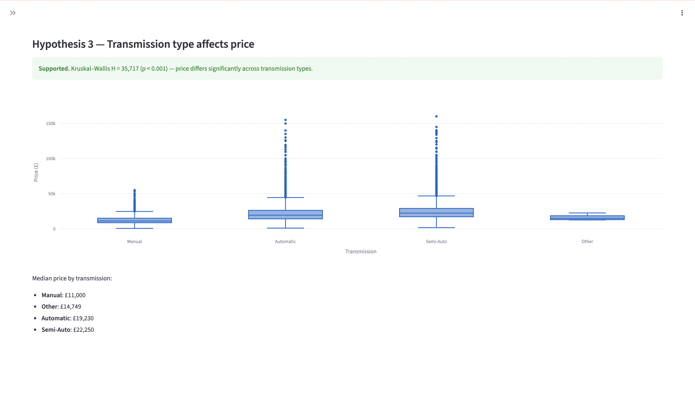

All three hypotheses were supported, and the same features (year, mileage, transmission) are
among the strongest drivers in the prediction model, which corroborates the findings.

---

## Mapping Business Requirements to Data Visualisations and ML Tasks

**Business Requirement 1 → Data Visualisation task.**
- *User story:* "As a sales manager, I want to see which attributes most affect price so that I
  can explain and justify my pricing."
- *Delivered by:* the **Price Correlation Study** page — a Spearman correlation heatmap, a
  median-price-by-year line chart, an average-price-by-manufacturer bar chart, and an
  interactive feature explorer (scatter for numeric features, box plot for categorical ones).

**Business Requirement 2 → Machine-learning task (regression).**
- *User story:* "As a salesperson, I want to enter a car's details and get an estimated sale
  price so that I can price stock quickly and consistently."
- *Delivered by:* the **Predict Sale Price** page — input widgets feed a trained regression
  pipeline that returns a predicted price, supported by the **ML Model Performance** page which
  evidences how reliable that prediction is.

---

## ML Business Case

**Aim.** Build a model that predicts the sale price of a used car from its attributes.

**Learning method.** Because the target (`price`) is a continuous numeric value, this is a
**supervised regression** problem.

**Target and features.** The target is `price`. The features are `year`, `mileage`,
`transmission`, `fuelType`, `tax`, `mpg`, `engineSize`, `manufacturer` and `model`.

**Success metric.** Agreed with the dealership before modelling: the model should explain at
least **80% of the variance in price (R² ≥ 0.80) on an unseen test set**, with no large gap
between training and test performance (i.e. it must generalise, not overfit). The model is
considered a failure if test R² falls below 0.80.

**Model output and use.** The model outputs a single predicted price in £, shown live on the
dashboard for the sales team to use as a pricing guide.

**Heuristics replaced.** The current process is manual valuation by staff; there is no existing
automated heuristic.

**Pipeline and algorithm.** A scikit-learn **Pipeline** first ordinal-encodes the categorical
features (using `OrdinalEncoder` with `handle_unknown="use_encoded_value"` so unseen categories
are handled safely at prediction time), then fits a regressor. Four candidate algorithms were
compared — Decision Tree, Random Forest, Extra Trees and Gradient Boosting — and the tree
ensembles performed best. **Extra Trees Regressor** was selected and tuned with `GridSearchCV`
across **six hyperparameters, three values each** (729 combinations × 3-fold cross-validation).
Tree size was deliberately capped (`max_depth`, `max_leaf_nodes`, minimum leaf size) so the
saved model stays small enough to deploy on Heroku and to reduce overfitting.

**Outcome.** The final pipeline achieves **test R² = 0.931** (train R² = 0.954) with a test mean
absolute error of about **£1,528**, comfortably meeting the success metric and generalising well.
The fitted pipeline is saved (versioned) to `outputs/ml_pipeline/predict_price/v1/pipeline.pkl`
and powers the live predictor.

---

## CRISP-DM Workflow

The project follows the CRISP-DM data-mining methodology, with one Jupyter notebook per stage:

1. **Business Understanding** — defined the two business requirements and the ML success metric.
2. **Data Understanding** — *Notebook 1: Data Collection* pulls the data from the Kaggle API,
   combines the per-manufacturer files, and profiles the result.
3. **Data Preparation** — *Notebook 2: Data Cleaning* removes duplicates and impossible values;
   *Notebook 4: Feature Engineering* analyses skew, cardinality and the encoding strategy.
4. **Modelling** — *Notebook 5: Modelling & Evaluation* builds, tunes and evaluates the pipeline.
   *Notebook 3: Correlation Study* underpins this with the feature/price analysis.
5. **Evaluation** — train/test R², MAE and RMSE plus Actual-vs-Predicted plots confirm the
   success metric is met.
6. **Deployment** — the model is served through a Streamlit dashboard deployed to Heroku.

---

## Dashboard Design

The dashboard is a multi-page Streamlit app with a sidebar navigation menu. It uses a clean
petrol-blue theme and Plotly for interactive charts. The sidebar navigation menu lets the
user move between the five pages:

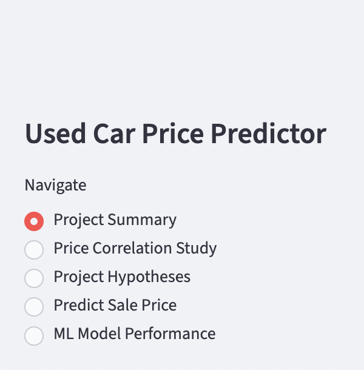

**Page 1 — Project Summary.** Introduces the project, shows headline dataset metrics (cars
analysed, manufacturers, price range), states both business requirements, and describes the
data. *(Shown at the top of this README.)*

**Page 2 — Price Correlation Study (Business Requirement 1).** Answers BR1 with four chart
types: a Spearman correlation heatmap, a median-price-by-year line chart, an
average-price-by-manufacturer bar chart, and an interactive dropdown that plots any chosen
feature against price (scatter for numeric, box plot for categorical). Closes with the key
findings for the dealership.

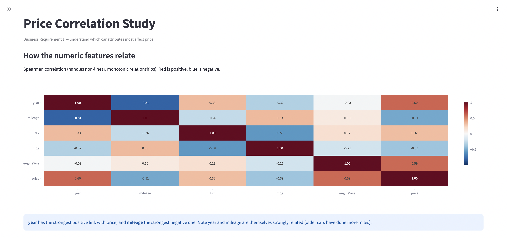
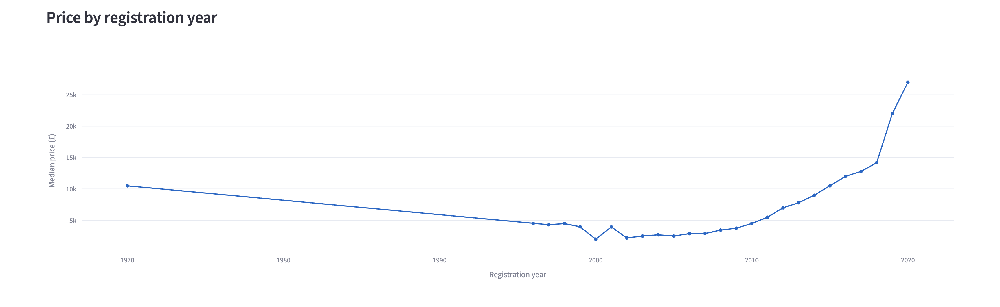
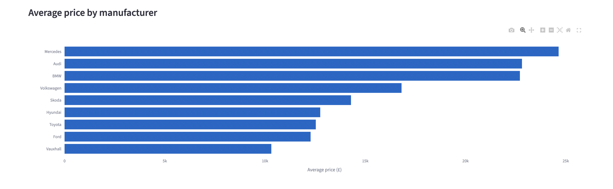
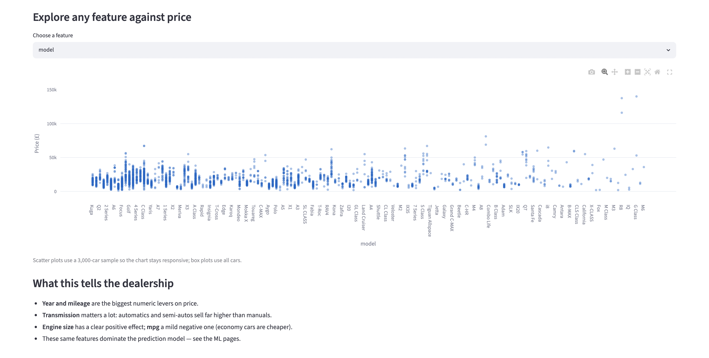

**Page 3 — Project Hypotheses.** States the three hypotheses, shows the validating statistic
recomputed live from the data, a "Supported" verdict for each, and a supporting chart.
*(Charts shown in the Hypotheses section above.)*

**Page 4 — Predict Sale Price (Business Requirement 2).** Input widgets for every feature (the
Model dropdown filters to the chosen Manufacturer). A "Predict sale price" button returns the
model's estimated price, with a note on its typical accuracy.

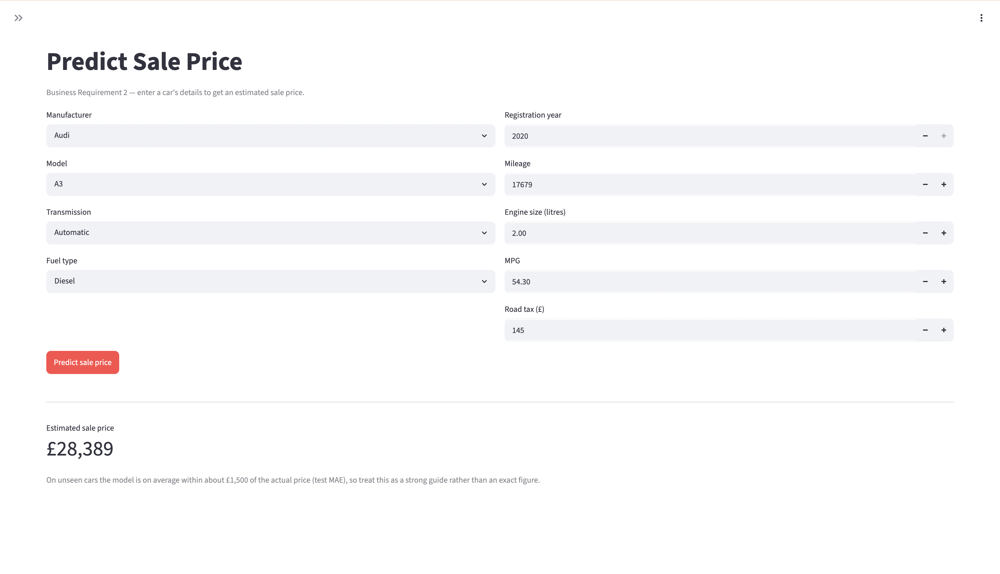

**Page 5 — ML Model Performance.** States the success metric and whether it was met, shows
train and test R²/MAE/RMSE as metric cards, Actual-vs-Predicted scatter plots for both sets,
the model's feature importances, and the chosen algorithm and best hyperparameters.

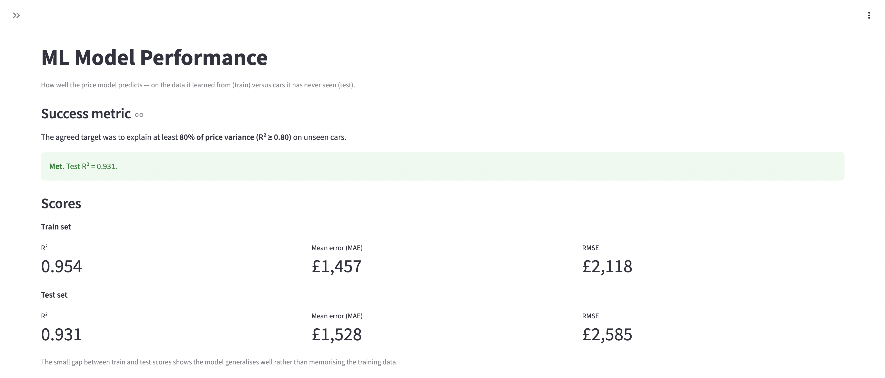
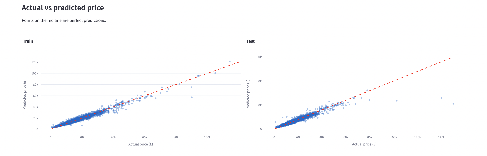
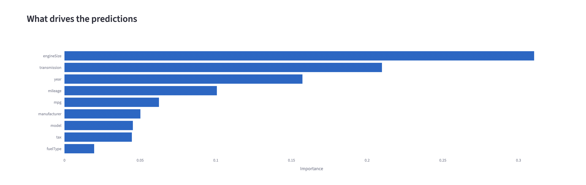
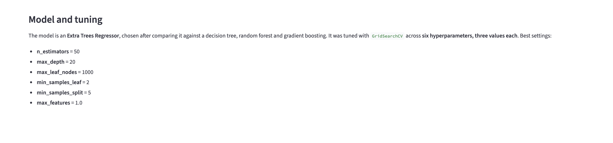

---

## Unfixed Bugs

There are no known unfixed bugs. During development, the hyperparameter search initially
exhausted the machine's memory when run in parallel and when the winning model was left
unconstrained; this was resolved by running the search sequentially and by capping tree size,
which also keeps the deployed model lightweight.

---

## Deployment

The app is deployed to **Heroku** via the GitHub integration.

1. Log in to Heroku and click **New → Create new app**; choose a unique app name and the
   Europe region.
2. Open the **Deploy** tab, set the deployment method to **GitHub**, and connect the
   `used-car-price-predictor` repository.
3. Under **Manual deploy**, select the `main` branch and click **Deploy Branch**.
4. Heroku installs the dependencies in `requirements.txt`, uses the Python version in
   `.python-version` (3.12), and runs the app via the `Procfile`
   (`web: sh setup.sh && streamlit run app.py`). `setup.sh` binds Streamlit to Heroku's
   dynamic `$PORT`.
5. When the build completes, click **Open app** to view the live dashboard.

The trained model and cleaned dataset are committed to the repository, so the deployed app has
everything it needs at runtime.

**Running locally:** clone the repo, install dependencies with `pip install -r requirements.txt`,
then run `streamlit run app.py`.

---

## Main Data Analysis and ML Libraries

- **pandas, numpy** — data loading, cleaning and manipulation.
- **scikit-learn** — the modelling pipeline, ordinal encoding, train/test split,
  `GridSearchCV` hyperparameter tuning, and evaluation metrics (R², MAE, RMSE).
- **feature-engine** — feature-engineering analysis.
- **ppscore** — predictive power scores in the correlation study.
- **matplotlib, seaborn** — static plots in the notebooks.
- **plotly** — interactive charts in the dashboard.
- **joblib** — saving and loading the trained pipeline.
- **streamlit** — the multi-page dashboard / Data App.
- **kaggle** — programmatic data collection from the Kaggle API.

---

## Credits

- **Dataset:** "100,000 UK Used Car Data set" by aditya desai, Kaggle, licensed CC0 Public
  Domain — https://www.kaggle.com/datasets/adityadesai13/used-car-dataset-ford-and-mercedes
- **Education and project brief:** Code Institute, Diploma in Full Stack Software Development
  (Predictive Analytics specialisation).
- **Tools and documentation:** scikit-learn, Streamlit, Plotly and Heroku official
  documentation.

This project was built for educational purposes as a portfolio project.
